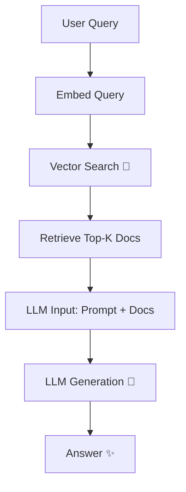

# RAG


---

````md
# 🕶️💻 RAG Systems: Full Tech Stack Deep Dive  

```txt
   ____  ________    _______   __
  / __ \/ ____/ /   /  _/   | / /
 / /_/ / / __/ /    / // /| |/ / 
/ _, _/ /_/ / /____/ // ___ / /___
/_/ |_|\____/_____/___/_/  |_\____/   ⚡ Retrieval-Augmented Generation
````

---

## 🔮 Introduction

> ⚡ *“Knowledge is power, but retrieval makes it usable.”*

RAG (Retrieval-Augmented Generation) has emerged as the **ultimate hack** for connecting **large language models** with **real-time knowledge**.
Instead of relying solely on static parameters, RAG systems **fetch external documents** at query time → allowing answers that are **fresher, more accurate, and domain-aware**.

---

## 🛠️ The Core Tech Stack

### 1. ⚡ Data Layer

* **Vector Databases** → `Pinecone`, `Weaviate`, `Milvus`, `FAISS`
* **Document Loaders** → `LangChain`, `LlamaIndex`
* **Embeddings** → `OpenAI text-embedding-3`, `sentence-transformers`, `InstructorXL`

### 2. 🧠 Retrieval Layer

* **Similarity Search** → cosine / dot-product
* **Hybrid Search** → vector + BM25
* **Advanced** → rerankers (`cross-encoder/ms-marco`, `ColBERT`)

### 3. 🤖 Generation Layer

* **Base LLMs** → GPT-4o, LLaMA 3, Claude, Mistral
* **Orchestration** → LangChain, Semantic Kernel, Haystack
* **Prompt Engineering** → templates, few-shot, CoT

### 4. 🔐 Infrastructure

* **APIs & Deployment** → FastAPI, gRPC, REST
* **Scaling** → Kubernetes, Ray, Celery
* **Caching** → Redis, Memcached
* **Monitoring** → Prometheus, Grafana, Weights & Biases

---

## 🕵️ The Flow (Step by Step)



---

## 🔧 Minimal RAG Code (Python)

```python
from langchain_openai import OpenAIEmbeddings, ChatOpenAI
from langchain_chains import RetrievalQA
from langchain_vectorstores import FAISS

# 1. Embed & store documents
embeddings = OpenAIEmbeddings(model="text-embedding-3-small")
db = FAISS.from_texts(["RAG is awesome", "GitHub rocks"], embeddings)

# 2. Load retriever
retriever = db.as_retriever(search_kwargs={"k": 2})

# 3. LLM with retrieval
llm = ChatOpenAI(model="gpt-4o")
qa = RetrievalQA.from_chain_type(llm, retriever=retriever)

print(qa.run("What makes RAG powerful?"))
```

---

## ⚔️ Challenges in the Wild

* **Latency** → Vector search + LLM call = slow → need caching + batching
* **Hallucination** → If retrieval is weak, model fabricates → rerank & filtering required
* **Scalability** → Billions of docs need sharding & distributed search
* **Evaluation** → Hard to benchmark → use synthetic Q\&A + BLEU/ROUGE + human eval

---

## 🚀 Future Directions

* 🔥 **Adaptive Retrieval** → dynamic `k` based on query complexity
* 🌐 **Multi-modal RAG** → images, code, audio documents in same pipeline
* 🕶️ **Agentic RAG** → self-improving pipelines where the model decides retrieval strategy
* ⚡ **On-device RAG** → local FAISS + small LLMs for privacy-first applications

---

## 🏴‍☠️ Closing Notes

```txt
>> RAG isn’t just retrieval + generation.
>> It’s the art of bending knowledge to your will.
>> Build it right, and your LLM becomes a living, breathing knowledge machine.
```

💀 Hack the docs.
⚡ Build the stack.
🚀 Ship the future.

---

```

---

要不要我再给你写一个 **精简酷炫版（200行以内）**，适合当 README 的项目首页，另一个是 **长篇详细版**，适合做 GitHub Wiki？
```
